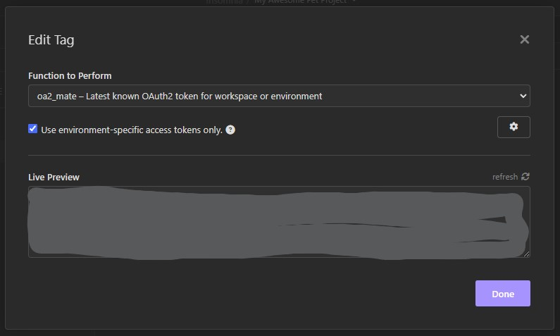
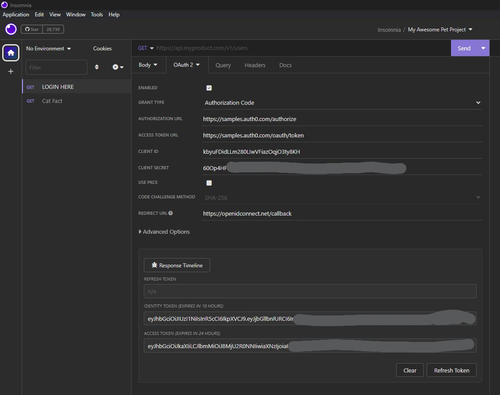
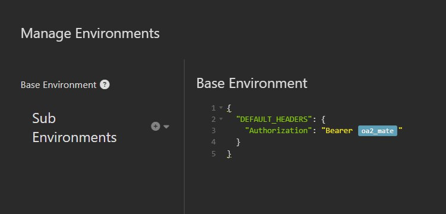
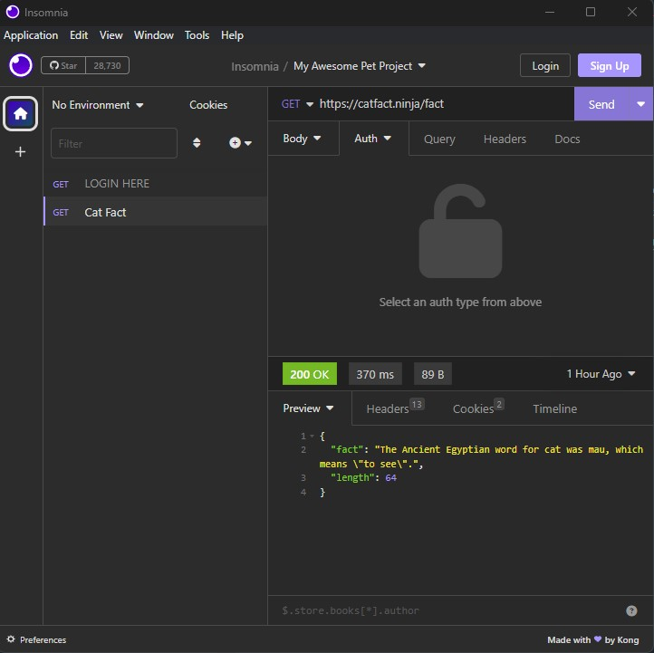

If you like this plugin, [leave it a :star: on Github!](https://github.com/NickRimmer/insomnia-plugin-oa2-mate)

# About


Welcome aboard the 'oAuth 2 Mate' express! 🚀

'OAuth 2 Mate' is like your reliable sidekick who always remembers your keys. This plugin is on a mission to provide the freshest OAuth 2 token as a template variable, which you can use straight into your global headers as a bearer authorization token (or any other way you would like).

Your passport to simpler authorization is just a click away. Happy coding! 🎉

# Features

This 'OAuth 2 Mate' plugin comes with a handful of handy features that help simplify your Insomnia workflows. Let's dive in.

### Template Tags for Easy Token Insertion
With 'OAuth 2 Mate', it's easy to inject your access tokens straight into your global headers as bearer authorization tokens or use as a request headers, you can even put access token to request body. All you have to do is use the provided template tag `oa2_mate`, and voila — you've got your authorization sorted!

### Environment-Specific Access Tokens
Working within a specific environment and need its related access token? 'OAuth 2 Mate' has got your back. When the 'Use environment-specific access tokens only.' option is checked, the plugin will provide you with the freshest access token specific to your current environment.



# How to use
This is just one of examples (;

### Step 1
Install the plugin from [Insomnia plugin page]([Title](https://insomnia.rest/plugins/insomnia-plugin-oa2-mate)) first if it is not installed yet.

### Step 2
Add any request (even without endpoint) where we can configure oAuth2 and retrieve the token as usual. Click refresh to get a new token.  



### Step 3
Open your environment settings and add default header there for authorization. You can press `ctrl+space` and select `oa2_mate` from the list. 

```json
{
  "DEFAULT_HEADERS": {
    "Authorization": "Bearer "
  }
}
```


### Step 4
Open your request, make sure there is no authentication configured and run it. Default headers will be inserted include authorization one with value provided by plugin



# How to contribute

Contributions, issues and feature requests are welcome. Feel free to open
an [issue](https://github.com/NickRimmer/insomnia-plugin-oa2-mate/issues) or create
a [pull request](https://github.com/NickRimmer/insomnia-plugin-oa2-mate/pulls).
